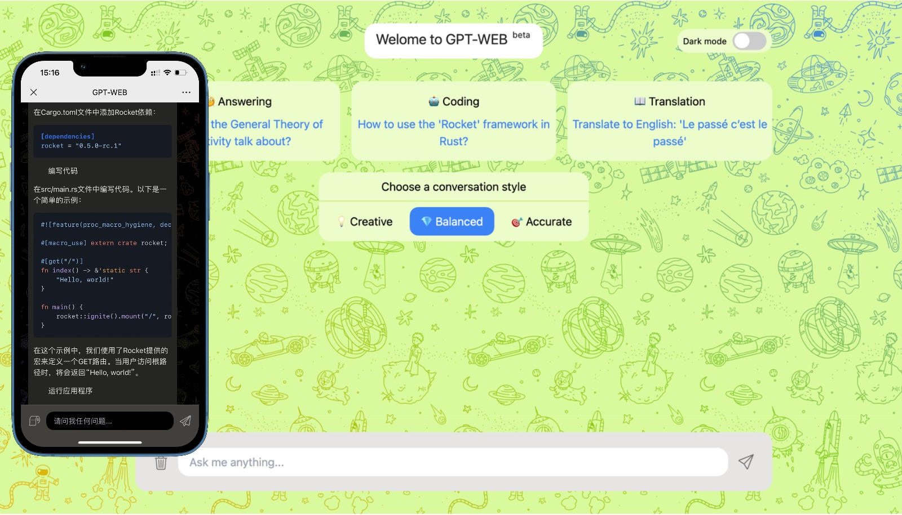

# gpt-web

A browser interface build by [svelte](https://github.com/sveltejs/svelte) and [gin-gonic](https://github.com/gin-gonic/gin) for [OpenAI ChatGPT API](https://openai.com/blog/openai-api).

## Features

- Proxy supported backend
- Responsive for mobile
- Dark mode
- Multiple languages supported
- Small frontend files (using code splitting and gzip)
- Docker ready

## Install and Running
